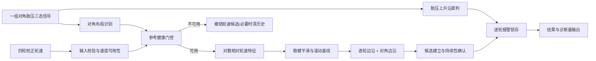
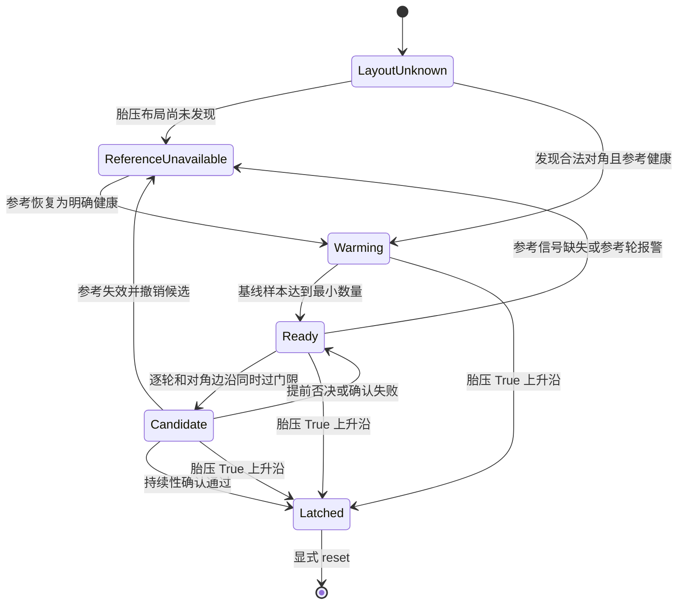

# 胎压对角融合爆胎检测算法技术规范

| 文档属性 | 内容 |
| --- | --- |
| 文档编号 | PFD-ALG-SPEC-001 |
| 算法标识 | `pressure_diagonal_fusion_v1` |
| 文档版本 | V1.0 Draft |
| 对应实现 | `PressureFusionBlowoutDetector` |
| 编制日期 | 2026-08-17 |
| 文档状态 | 开发评审稿，非量产放行文件 |
| 责任人 | 待项目指定 |
| 评审角色 | 算法、软件、测试、功能安全、系统集成 |

## 1. 文档目的

本文档定义胎压对角融合爆胎检测算法的业务目标、适用边界、输入输出契约、
数学模型、状态转换、标定参数、故障降级、验证证据及量产准入要求，供以下活动
共同使用：

- 算法设计与代码评审；
- ECU 或域控制器集成；
- SIL、HIL、道路及实车爆胎试验设计；
- 标定冻结和版本变更管理；
- 故障定位、日志分析和售后问题复现；
- 功能安全分析的上层输入。

本文档描述当前仓库中的实际实现，不代表算法已经通过量产安全认证。代码、冻结
配置、测试报告三者发生冲突时，应停止发布并执行配置审计，不允许在未评审的情况
下任选其一作为交付依据。

## 2. 执行摘要

本算法面向“四轮具备校正轮速、仅一组对角轮具备逐轮胎压爆胎信号”的车辆配置。
它采用决策级融合，而不是对胎压值和轮速值做数值加权：

- 胎压对角的两个轮由胎压爆胎信号直接定位并立即锁存报警；
- 另一对角的两个轮通过相对轮速特征分别检测；
- 胎压对角同时作为轮速检测的健康参考；
- 参考对角信号缺失或任一参考轮已报警时，暂停纯轮速判定，防止污染参考引发连锁
  误报；
- 轮速分支同时要求逐轮证据、对角证据和持续性证据成立，以较高确认延迟换取较低
  误报。

在默认 100 Hz 配置下，轮速分支需要约 2 秒正常基线，并在候选建立后观察约
0.7 秒。当前实车回放中的平均确认延迟为 0.828 秒。胎压分支在 `False/None → True`
的首帧立即报警。

## 3. 适用范围

### 3.1 适用车辆与信号配置

算法只支持以下两种布局之一：

| 胎压直接检测对角 | 轮速推断对角 |
| --- | --- |
| FL + RR | FR + RL |
| FR + RL | FL + RR |

轮位固定定义为：

| 索引 | 缩写 | 含义 |
| ---: | --- | --- |
| 0 | FL | 左前轮 |
| 1 | FR | 右前轮 |
| 2 | RL | 左后轮 |
| 3 | RR | 右后轮 |

### 3.2 前提条件

集成系统应满足以下前提：

1. 提供四轮同时间基准的轮速，推荐使用齿圈误差校正后的轮速；
2. 默认采样频率为 100 Hz；
3. 胎压信号能够区分“确认爆胎”“确认正常”和“不可用”；
4. 两个可用胎压信号必须完整覆盖一条对角线；
5. 时间戳严格递增；
6. 上层系统负责定义报警锁存后的维修、下电或诊断复位策略。

`sample_rate_hz` 只参与估算事件起点时间，不会自动缩放滤波、基线和确认窗口。
如果实际采样率不是 100 Hz，必须成组重新换算窗口帧数、重新标定并重新验证。

### 3.3 非目标

当前版本不承诺完成以下能力：

- 仅靠相对轮速检测四轮同时、同幅度变化的故障；
- 在胎压参考对角已经爆胎后，继续对另一对角作强轮速判定；
- 支持单个胎压轮、同轴两个胎压轮或动态切换胎压布局；
- 从原始胎压数值自行判断爆胎；输入必须已经是逐轮布尔判定；
- 替代车辆稳定控制、TPMS 法规报警或功能安全机制；
- 在未经重新标定的采样率、轮胎规格和轮速预处理链路上保证现有性能。

## 4. 需求定义

| 需求编号 | 需求描述 | 安全/业务意图 |
| --- | --- | --- |
| PFD-FUN-001 | 系统应自动识别 FL+RR 或 FR+RL 胎压对角 | 兼容两种硬件布局 |
| PFD-FUN-002 | 胎压 `True` 上升沿应在当前帧锁存对应轮位报警 | 保证直接信号低延迟 |
| PFD-FUN-003 | 无胎压对角的两个轮应独立运行轮速检测 | 支持单轮、同时和先后故障 |
| PFD-FUN-004 | 轮速报警应同时具备逐轮和对角证据 | 抑制局部噪声及错误定位 |
| PFD-FUN-005 | 报警应保持锁存，直到显式 `reset()` | 避免故障信号短暂恢复导致漏报 |
| PFD-SAF-001 | 胎压参考信号不是明确健康时，不得输出新的纯轮速强判定 | 避免污染参考引发误报 |
| PFD-SAF-002 | 低速或无效轮速期间应取消候选 | 避免无可观测性条件下误判 |
| PFD-SAF-003 | 胎压对角运行中变化时应拒绝输入 | 避免轮位映射不一致 |
| PFD-DIA-001 | 每帧应输出可用性、内部证据、候选、报警源和估算起点 | 支持可诊断与可追溯 |
| PFD-PER-001 | 单帧计算和存储开销应有固定上界 | 满足在线实时执行 |

## 5. 系统上下文与数据流



算法每接收一帧执行一次 `push(frame)`，不读取未来样本，是因果在线算法。

## 6. 输入接口契约

### 6.1 帧结构

```python
PressureFusionFrame(
    t_sec: float,
    wheels: tuple[float, float, float, float],
    pressure_blowouts: tuple[bool | None, bool | None, bool | None, bool | None],
)
```

### 6.2 字段语义

| 字段 | 约束 | 处理方式 |
| --- | --- | --- |
| `t_sec` | 有限浮点数、严格递增 | 非法时抛出 `ValueError` |
| `wheels` | 固定四项、每项为有限浮点数 | 检测时取绝对值；接口仍保留原始值输出 |
| `pressure_blowouts` | 固定四项、元素为 `True/False/None` | 按三态语义处理 |

胎压三态定义：

| 值 | 语义 | 对轮速分支的影响 |
| --- | --- | --- |
| `True` | 胎压系统确认该轮爆胎 | 直接报警；参考不健康 |
| `False` | 胎压系统确认该轮正常 | 可作为健康参考 |
| `None` | 无传感器、信号缺失或当前不可用 | 不能作为健康参考 |

布局发现前允许四项均为 `None`，但轮速检测不可用。只要出现非 `None` 项，位置集合
必须恰好为 `(FL, RR)` 或 `(FR, RL)`。发现后的布局在一次实例生命周期中不得改变；
需要改变时必须先 `reset()`。

### 6.3 时序约束

实现只检查时间戳递增，不检查相邻帧是否严格等间隔，也不检测丢帧。生产集成层
应监控帧周期、抖动和丢帧，并在超限时把结果降级为不可用或复位检测器。不得仅因
时间戳仍递增就假定 100 Hz 时序有效。

## 7. 输出接口契约

`PressureFusionResult` 每帧输出以下信息：

| 字段 | 类型/维度 | 语义 |
| --- | --- | --- |
| `sensor_diagonal` | 轮位元组 | 已识别的胎压对角 |
| `speed_diagonal` | 轮位元组 | 由轮速检测的互补对角 |
| `speed_valid` | bool | 轮速数值及平均速度满足基本条件 |
| `speed_detection_available` | bool | 轮速有效且胎压参考明确健康 |
| `individual_gains` | 4 项 | 逐轮相对基线增益；不适用时为 `NaN` |
| `individual_edges` | 4 项 | 逐轮因果边沿；数据不足时为 `NaN` |
| `diagonal_gain` | float | 对角残差相对基线增益 |
| `diagonal_edge` | float | 对角残差因果边沿 |
| `candidates` | 4 项 bool | 返回时仍处于候选观察期的轮位 |
| `new_blowouts` | 4 项 bool | 仅本帧新锁存的报警 |
| `blowout_alarms` | 4 项 bool | 当前累计锁存报警 |
| `alarm_sources` | 4 项字符串 | `none`、`pressure` 或 `wheel_speed_confirmed` |
| `estimated_onset_indices` | 4 项可空整数 | 估算事件起点帧索引 |
| `estimated_onset_times_s` | 4 项可空浮点 | 估算事件起点时间 |

上层报警接口应使用 `blowout_alarms` 表示持续状态，使用 `new_blowouts` 触发一次性
事件。禁止把 `candidates` 当成正式爆胎报警。

## 8. 算法详细设计

### 8.1 胎压对角自动发现

定义两个合法对角：

\[
\mathcal{D}_0=\{FL,RR\}, \qquad \mathcal{D}_1=\{FR,RL\}
\]

当前帧中非 `None` 胎压项的索引集合记为 \(\mathcal{S}\)。首次满足
\(\mathcal{S}=\mathcal{D}_0\) 或 \(\mathcal{S}=\mathcal{D}_1\) 时：

\[
sensor\_diagonal=\mathcal{S}
\]

\[
speed\_diagonal=(\mathcal{D}_0\cup\mathcal{D}_1)\setminus\mathcal{S}
\]

布局识别结果保持到显式复位。运行中出现另一条对角或非对角的部分信号时，接口
抛出异常，不执行静默重映射。

### 8.2 胎压直接报警分支

每轮保存上一帧胎压激活状态：

\[
active_i(t)=[pressure_i(t)=True]
\]

当 \(active_i(t)=1\) 且 \(active_i(t-1)=0\) 时：

1. 将该轮 `blowout_alarm` 置为真；
2. 将来源设为 `pressure`；
3. 将当前帧和当前时间记录为事件起点；
4. 清除该轮未完成的轮速候选；
5. 若此前尚未报警，将 `new_blowout` 置为真。

胎压报警不做去抖延迟，输入侧胎压诊断器必须自行保证 `True` 的可信度。

### 8.3 轮速分支可用性门控

令轮速幅值为：

\[
v_i=|wheel_i|
\]

基本有效性条件为：

\[
speed\_valid = [\min_i(v_i)>10^{-9}]
\land
\left[\frac{1}{4}\sum_i v_i \geq min\_avg\_speed\right]
\]

参考健康条件为：

\[
reference\_healthy =
\bigwedge_{j\in sensor\_diagonal}
([pressure_j=False]\land[alarm_j=False])
\]

只有满足下式时才执行轮速检测：

\[
speed\_detection\_available = speed\_valid \land reference\_healthy
\]

这里采用严格健康语义：`None` 不是“未报故障”，而是“无法证明健康”。

### 8.4 对数相对轮速特征

对有效轮速取自然对数：

\[
x_i=\ln(v_i)
\]

设胎压参考对角为 \(S=\{s_1,s_2\}\)，轮速检测对角为
\(V=\{u_1,u_2\}\)。参考对角的对数均值为：

\[
\bar{x}_S=\frac{x_{s_1}+x_{s_2}}{2}
\]

每个轮速目标轮的逐轮原始特征为：

\[
r_i=x_i-\bar{x}_S, \qquad i\in V
\]

对角原始特征为：

\[
q=x_{u_1}+x_{u_2}-x_{s_1}-x_{s_2}
\]

并且：

\[
q=r_{u_1}+r_{u_2}
\]

逐轮特征负责定位目标轮，对角特征负责提供跨轮一致性。对数差可以解释为相对
比例变化；当变化较小时，`0.006` 约等于 `0.6%`。

选择对角残差的物理原因是，每条对角都包含一个左轮、一个右轮、一个前轮和一个
后轮，因此共同加减速、一阶左右轮速差和稳定前后轴差能够在理想条件下近似抵消。
该抵消依赖车辆运动对称性，不应被理解为对所有极限工况都严格成立。

### 8.5 稳健平滑

逐轮特征和对角特征使用相同的两级因果平滑。设窗口长度为 \(N_s\)：

1. 对最近最多 \(N_s\) 个原始值取中位数；
2. 对最近最多 \(N_s\) 个中位数结果取算术平均。

默认 `smooth_window=5`。该组合用于抑制单点脉冲，同时保留持续阶跃。启动初期窗口
未满时使用已有样本计算，因此系统仍必须依赖后续基线预热门控，不能把未满窗口的
特征用于报警。

### 8.6 正常基线

每个目标轮和对角特征分别维护正常历史队列：

- 最长保存 `baseline_window=500` 帧；
- 至少达到 `baseline_min_samples=200` 帧才输出有效基线；
- 基线取队列中位数；
- 每 `baseline_refresh_frames=10` 帧刷新一次缓存。

逐轮增益和对角增益定义为：

\[
g_i=\widetilde{r_i}-median(B_i)
\]

\[
g_D=\widetilde{q}-median(B_D)
\]

候选存在期间或轮速对角已有锁存报警时停止更新基线，避免异常被吸收到正常模型。

### 8.7 因果边沿

设 `edge_half_window=h=6`，对最近 \(2h\) 个增益计算：

\[
edge(t)=\frac{1}{h}\sum_{k=0}^{h-1}g(t-k)
-\frac{1}{h}\sum_{k=h}^{2h-1}g(t-k)
\]

它表示“最近 6 帧均值”减去“此前 6 帧均值”。100 Hz 下每半窗为 60 ms，完整
比较跨度为 120 ms。逐轮和对角各自计算边沿。

### 8.8 候选建立

轮速检测对角中的每个轮独立维护候选。当以下条件同时成立时建立该轮候选：

\[
edge_i \geq 0.0058
\]

\[
edge_D \geq 0.0058
\]

候选保存：

- 逐轮增益序列；
- 对角增益序列；
- 同对角另一轮的增益序列；
- 四轮共同对数速度序列；
- 逐轮和对角历史峰值；
- 估算事件起点。

起点相对候选建立帧回推：

\[
delay=(smooth\_window-1)+edge\_half\_window=10\ frames
\]

默认配置下回推约 0.1 秒。该值是滤波群延迟的工程估算，不是传感器级真实破裂
时刻的保证值。

### 8.9 候选提前否决

候选观察期间满足任一条件即立即撤销：

- 当前逐轮增益低于 `-0.0040`；
- 当前对角增益低于 `-0.0040`；
- 逐轮峰值超过 `0.0250`；
- 对角峰值超过 `0.0450`。

下限用于排除方向相反或已经完全回落的事件；上限用于排除明显超出当前爆胎标定
包络的冲击、信号跳变或其他异常。被否决不等于“确认正常”，后续出现新的合格
上升沿仍可重新建立候选。

### 8.10 持续性确认

候选累计 `confirm_frames=70` 个样本后执行一次确认。取最后
`persistence_tail_frames=40` 帧，要求以下条件全部成立：

| 条件 | 默认阈值 | 目的 |
| --- | ---: | --- |
| 逐轮历史峰值 | ≥ 0.0070 | 确认目标轮变化幅度 |
| 对角历史峰值 | ≥ 0.0070 | 确认对角共同证据 |
| 尾窗逐轮增益中位数 | ≥ 0.0055 | 确认目标轮持续偏快 |
| 尾窗对角增益中位数 | ≥ 0.0055 | 确认对角证据持续 |
| 逐轮高位占比 | ≥ 75% 的样本达到 0.0035 | 排除短脉冲 |
| 对角高位占比 | ≥ 75% 的样本达到 0.0035 | 排除短脉冲 |
| 同组另一轮增益中位数 | ≥ -0.0035 | 排除伴随明显反向变化 |
| 候选期间共同对数速度极差 | ≤ 0.050 | 排除剧烈整车速度瞬变 |

所有条件成立时，锁存该轮报警并将来源设为 `wheel_speed_confirmed`。任一条件不成立
时，本次候选结束；算法不会延长当前候选等待时间，必须等待新的合格边沿才能再次
建立候选。

### 8.11 状态模型

概念状态如下。代码使用基线长度、候选对象和锁存位表达这些状态，没有单独的枚举。



四个轮位的锁存状态彼此独立，但轮速分支共享胎压参考健康门控和对角证据。

## 9. 默认标定参数

| 参数 | 默认值 | 100 Hz 时间/近似比例 | 说明 |
| --- | ---: | ---: | --- |
| `sample_rate_hz` | 100.0 | 100 Hz | 期望采样频率 |
| `min_avg_speed` | 20.0 | 与输入轮速同单位 | 轮速检测最低平均速度 |
| `smooth_window` | 5 | 50 ms | 两级平滑各自窗口长度 |
| `edge_half_window` | 6 | 60 ms | 边沿前、后半窗长度 |
| `baseline_window` | 500 | 5.0 s | 正常基线最大历史 |
| `baseline_min_samples` | 200 | 2.0 s | 最短预热时间 |
| `baseline_refresh_frames` | 10 | 100 ms | 中位数缓存刷新周期 |
| `min_individual_edge` | 0.0058 | 约 0.58% | 逐轮候选边沿门限 |
| `min_diagonal_edge` | 0.0058 | 约 0.58% | 对角候选边沿门限 |
| `min_individual_peak` | 0.0070 | 约 0.70% | 逐轮最小峰值 |
| `min_diagonal_peak` | 0.0070 | 约 0.70% | 对角最小峰值 |
| `max_individual_peak` | 0.0250 | 约 2.53% | 逐轮最大允许峰值 |
| `max_diagonal_peak` | 0.0450 | 约 4.60% | 对角最大允许峰值 |
| `confirm_frames` | 70 | 0.70 s | 候选观察长度 |
| `persistence_tail_frames` | 40 | 0.40 s | 持续性尾窗长度 |
| `min_individual_persistence` | 0.0055 | 约 0.55% | 逐轮尾窗中位数门限 |
| `min_diagonal_persistence` | 0.0055 | 约 0.55% | 对角尾窗中位数门限 |
| `persistence_floor` | 0.0035 | 约 0.35% | 高位占比统计下限 |
| `min_persistence_fraction` | 0.75 | 75% | 尾窗最小高位占比 |
| `min_mate_persistence` | -0.0035 | 约 -0.35% | 同组另一轮下限 |
| `max_common_speed_range` | 0.050 | 约 5.13% 极差 | 候选期共同速度变化上限 |
| `candidate_drop_limit` | -0.0040 | 约 -0.40% | 候选提前撤销下限 |
| `clear_after_invalid_frames` | 50 | 0.50 s | 连续无效轮速后清历史 |

比例列使用 \(e^x-1\) 换算或小量近似，仅用于解释。正式比较始终使用代码中的
对数阈值。

## 10. 降级与故障处理

| 场景 | 当前行为 | 上层建议 |
| --- | --- | --- |
| 时间戳不递增或存在非有限值 | 抛出 `ValueError` | 记录接口故障并隔离该数据源 |
| 胎压位置不是完整对角 | 抛出 `ValueError` | 作为配置错误处理，禁止上线 |
| 运行中胎压对角变化 | 抛出 `ValueError` | 检查轮位映射；必要时在安全条件下复位 |
| 胎压四项全为 `None` | 轮速检测不可用 | 输出降级状态，不得解释为无爆胎 |
| 胎压参考任一项为 `None` | 清轮速候选和边沿，保留基线历史 | 监控信号缺失持续时间 |
| 胎压参考任一轮为 `True` 或已锁存 | 胎压轮报警；纯轮速检测持续不可用 | 进入故障处置，不自动恢复 |
| 平均轮速低于阈值或任一轮为零 | 清轮速候选和边沿 | 低速阶段依赖胎压分支 |
| 连续 50 帧轮速无效 | 额外清除平滑和基线历史 | 恢复后重新预热至少 2 秒 |
| 轮速有效但参考不健康 | 不累计“无效轮速”计数，基线保留 | 参考恢复策略必须由系统安全分析决定 |

特别注意：`speed_detection_available=False` 表示算法当前无法可靠作纯轮速强判定，
不是“确认其他轮正常”。上层 HMI、诊断和数据记录必须保留这一区别。

## 11. 安全属性与设计约束

### 11.1 已实现的安全属性

1. **参考污染隔离**：参考对角任一轮不明确健康时，轮速强判定被关闭。
2. **双证据门控**：单轮边沿不能单独建立候选，必须同时出现对角边沿。
3. **持续性确认**：瞬时脉冲不能直接生成轮速报警。
4. **基线冻结**：候选和已确认异常不会被持续吸收到正常基线。
5. **报警锁存**：短暂信号恢复不会自动撤销已确认报警。
6. **布局不变式**：对角映射在复位前不可静默改变。

### 11.2 需要系统层补充的安全机制

- 采样周期、丢帧、时间同步和信号新鲜度监控；
- 胎压布尔判定本身的可信度、去抖和故障诊断；
- 轮速齿圈误差校正状态和校正参数完整性检查；
- 算法不可用时的驾驶员告警、功能降级和故障码策略；
- 报警复位授权，防止行驶中误复位；
- 参数和软件镜像的版本校验、签名及回滚策略；
- ASIL 分解、独立性分析及系统 FMEA/FMEDA。当前算法文档本身不构成 ISO 26262
  合规声明。

## 12. 已知局限与风险

### 12.1 可观测性限制

算法使用相对轮速。当四轮发生近似相同的比例变化时，逐轮和对角差分可能同时
抵消。没有胎压信号的轮位需要独立胎压、可信车速、轮端加速度或其他冗余信息才能
覆盖此类故障。

### 12.2 参考失效后的覆盖缺口

胎压参考对角任一轮报警后，另一对角的轮速检测被暂停。这是有意的低误报策略，
但意味着多轮爆胎场景中的后续故障可能无法由本算法单独确认。系统安全目标若要求
参考失效后继续覆盖，必须增加独立观测源，不应简单放宽健康门控。

### 12.3 数据与标定外推风险

当前实车正样本只覆盖 RR。其他轮位和多轮事件主要通过轮位变换及合成回归验证。
轮胎规格、胎压、载荷、路面附着、转向强度、制动、驱动扭矩、ABS/ESC 介入和传感器
型号变化，都可能改变特征分布。

### 12.4 固定帧窗口风险

所有滤波与状态窗口按帧数配置。采样率下降、抖动或丢帧会改变真实时间尺度，而
当前实现不会自动补偿。

### 12.5 异常峰值策略风险

超过最大峰值的候选会被否决。这能够抑制信号跳变，但也可能排除比开发数据更严重
的真实爆胎。最大峰值必须通过独立实车包络试验确认。

## 13. 性能与资源特性

每帧仅处理固定四轮数据，主要操作包括固定长度队列更新、短窗求和以及滚动窗口
中位数。队列容量由配置限定，内存不会随运行时间增长。

默认情况下，中位数基线最多处理 500 个样本，并每 10 帧刷新一次。算法复杂度对
车辆运行时长为常数上界，适合在线执行。正式 ECU 集成仍应在目标硬件上测量：

- 最坏执行时间 WCET；
- 平均和峰值 CPU 占用；
- 静态、堆和栈内存；
- 异常输入路径执行时间；
- 多实例并行时的调度影响。

Python 实现是参考实现和离线工具，不应直接推定为目标 ECU 的实时实现。

## 14. 验证现状

### 14.1 当前回放结果

评估快照日期为 2026-08-05，算法标识为 `pressure_diagonal_fusion_v1`。

| 数据集 | 覆盖范围 | 结果 |
| --- | --- | --- |
| `ly` 实车爆胎 | 8 条 RR 爆胎；FR+RL 胎压明确健康，RR 使用轮速检测 | 8/8 检出；事件前或错误轮位报警 0；平均确认延迟 0.828 s；最大 0.85 s |
| `RobustData` 正常道路 | 37 条、8,922,100 帧、24.78 h；两种胎压布局分别回放 | 两种布局均为 0/37 记录误报，错误报警轮数为 0 |
| 合成回归 | 两种布局、四轮轮位、同时和先后多轮事件、参考污染门控 | 当前回归用例通过 |

### 14.2 证据等级说明

以上结果属于开发回放，不是独立锁参验证，原因如下：

- 阈值是在观察相同 `ly` 和 `RobustData` 数据后选择的；
- 真实正样本只覆盖 RR；
- FL、FR、RL 真实爆胎尚未覆盖；
- 多轮正样本来自合成测试；
- 尚未给出按速度、轮胎、载荷、路面、驾驶工况分层的置信区间。

因此，当前状态应表述为“开发数据上满足预期”，不得表述为“量产误报率为零”或
“四轮实车验证完成”。

## 15. 测试策略与量产准入

### 15.1 单元与回归测试

最低自动化覆盖应包括：

1. 两种胎压对角自动识别；
2. 非法布局和运行中布局变化被拒绝；
3. 四个轮位的直接胎压定位；
4. 四个轮位的轮速定位；
5. 轮速对角两轮同时和先后报警；
6. 胎压脉冲报警保持锁存；
7. 参考轮报警立即关闭轮速检测；
8. 低速、零速、负轮速、`NaN`、无穷值和时间戳异常；
9. 基线预热、冻结、长时间无效后的重建；
10. 每一个门限的边界值、上下一个浮点步长和组合条件；
11. `reset()` 后所有历史、候选、布局和报警清零；
12. 采样抖动和丢帧由集成层正确降级。

### 15.2 独立数据验证

参数冻结后，应使用开发阶段未查看的数据执行盲测。建议至少按以下维度分层：

- FL、FR、RL、RR 四个真实爆胎轮位；
- 两种胎压硬件对角布局；
- 直线、弯道、变道、坡道、制动、驱动和滑行；
- 不同车速区间及阈值附近低速；
- 不同载荷、胎压、轮胎品牌、尺寸、磨损和温度；
- 干燥、湿滑、低附着、粗糙和破损路面；
- ABS、TCS、ESC 介入及轮胎打滑；
- 传感器跳变、短时缺失、冻结、偏置和齿圈误差；
- 单轮、多轮同时、多轮先后及参考轮先爆场景。

### 15.3 建议验收指标

项目必须在试验前冻结以下指标及统计口径：

| 指标 | 必须定义的内容 |
| --- | --- |
| 检出率 | 分轮位、分工况的样本量、点估计和置信下界 |
| 误报率 | 按运行小时、行驶里程、车辆次和错误轮位分别统计 |
| 报警延迟 | P50、P95、P99、最大值及事件时刻标注规则 |
| 轮位准确率 | 单轮、多轮、直接胎压和轮速来源分别统计 |
| 可用率 | `speed_detection_available` 的时间占比及不可用原因 |
| 恢复时间 | 长时间无效后重新达到可判定状态所需时间 |
| 资源指标 | 目标硬件 WCET、内存和调度裕量 |

在系统安全目标和整车使用场景未明确前，本文档不擅自给出量产通过门限。门限应由
整车安全分析、法规要求和风险接受准则共同确定。

### 15.4 当前量产准入缺口

在以下事项关闭前，不建议标记为 Production Ready：

- 完成四轮位独立真实爆胎试验；
- 完成锁参后的独立正常道路和正样本盲测；
- 覆盖参考对角先爆及多轮真实故障；
- 完成采样时序和信号新鲜度监控；
- 冻结报警复位、故障码和降级 HMI 策略；
- 完成目标硬件实时性和数值一致性验证；
- 完成参数版本化、校验、防篡改和回滚设计；
- 由功能安全和整车系统团队批准残余风险。

## 16. 可观测性与生产诊断

生产实现至少应记录或计数以下诊断量：

- 算法版本、参数集版本和轮位映射版本；
- `sensor_diagonal`、`speed_diagonal`；
- `speed_valid`、`speed_detection_available` 及不可用原因码；
- 各轮 `gain`、`edge`、候选进入和退出原因；
- `diagonal_gain`、`diagonal_edge`；
- 报警轮位、来源、确认时间和估算起点；
- 胎压三态输入及其新鲜度；
- 轮速帧周期、丢帧计数和连续无效帧数；
- 复位来源、复位时间和授权上下文。

建议使用带触发的环形缓冲，在候选建立或报警时保留事件前后原始轮速和胎压数据。
日志必须遵守隐私、容量和保留期限要求。

生产监控不应只统计报警数量，还应统计不可用时间。长期保持低误报但算法大部分时间
不可用，不代表性能达标。

## 17. 集成示例

```python
from wavelet_shape_blowout_detector import (
    PressureFusionBlowoutDetector,
    PressureFusionFrame,
)

detector = PressureFusionBlowoutDetector()

# 本车 FR+RL 具备胎压判定，FL+RR 使用轮速推断。
result = detector.push(
    PressureFusionFrame.from_sequences(
        t_sec,
        [fl_speed, fr_speed, rl_speed, rr_speed],
        [None, fr_pressure_blowout, rl_pressure_blowout, None],
    )
)

if any(result.new_blowouts):
    publish_blowout_event(
        alarms=result.blowout_alarms,
        sources=result.alarm_sources,
        onset_times=result.estimated_onset_times_s,
    )

if not result.speed_detection_available:
    publish_detector_degraded_state()
```

示例中的 `publish_*` 为集成层伪接口，不属于当前仓库实现。

## 18. 离线回放接口

CSV 工具支持指定四轮轮速列、时间列和一条胎压对角的两列信号。例如 FR+RL 为
胎压对角：

```bash
python3 -m wavelet_shape_blowout_detector.pressure_fusion_cli \
  --input wheel_speed.csv \
  --output pressure_fusion_result.csv \
  --pressure-fr-column FR_pressure_blowout \
  --pressure-rl-column RL_pressure_blowout
```

离线输出包含逐轮增益、边沿、候选、报警、来源和估算起点，可用于回归比较。用于
正式验证时，还必须保存输入文件哈希、软件提交号、参数集、命令行和运行环境。

## 19. 配置与变更管理

以下任一变化都应触发影响分析，不能作为普通代码重构处理：

- 任一阈值或窗口长度变化；
- 采样频率、轮速单位或预处理变化；
- 胎压三态语义或去抖逻辑变化；
- 轮位顺序、对角布局或车身坐标定义变化；
- 候选失败后重试策略变化；
- 报警锁存或复位语义变化；
- 参考健康条件变化；
- 浮点类型、数学库或目标平台变化。

每个发布版本应固定并可追溯：

```text
算法代码版本
+ 参数集版本
+ 输入信号接口版本
+ 标定数据版本
+ 独立验证报告版本
+ 目标平台构建版本
```

参数修改后必须至少重跑全部单元测试、正常道路全集、正样本全集和边界工况测试。
正式发布禁止在测试结果不变的假设下只替换参数文件。

## 20. 需求追踪矩阵

| 需求编号 | 当前实现位置 | 当前验证证据 |
| --- | --- | --- |
| PFD-FUN-001 | `_discover_diagonal()` | `test_auto_discovers_either_diagonal_without_false_alarm` |
| PFD-FUN-002 | `_apply_pressure()` | `test_pressure_wheels_are_localized_directly` |
| PFD-FUN-003 | `_advance()` 的逐轮候选 | 单轮、同时和先后爆胎单元测试 |
| PFD-FUN-004 | `edge` 与 `diag_edge` 双门限、持续性确认 | 合成回归及实车 RR 回放 |
| PFD-FUN-005 | `_alarms` 锁存、`reset()` | `test_latched_reference_alarm_stays_unusable_after_pressure_pulse` |
| PFD-SAF-001 | `_reference_healthy()` | `test_reference_blowout_suspends_speed_only_decisions` |
| PFD-SAF-002 | `_handle_unavailable()` | 需补充完整边界自动化测试 |
| PFD-SAF-003 | `_discover_diagonal()` | `test_invalid_or_changing_layout_is_rejected` |
| PFD-DIA-001 | `PressureFusionResult` | 显示台、CSV 回放及显示测试 |
| PFD-PER-001 | 有界 `deque` 和固定四轮处理 | 需目标硬件 WCET 验证 |

## 21. 运维处置建议

### 21.1 出现胎压来源报警

1. 保留报警前后数据和胎压源诊断；
2. 将参考对角视为不再健康；
3. 不得通过胎压信号短暂恢复自动清除锁存；
4. 按整车故障策略提示驾驶员并限制相关功能；
5. 维修或确认安全条件后，由授权流程执行复位。

### 21.2 出现轮速来源报警

1. 保存四轮原始/校正轮速、增益、边沿和候选历史；
2. 检查是否伴随 ABS/ESC、打滑、齿圈或轮速传感器故障；
3. 对照 `estimated_onset_time_s` 回看事件，但不要将其当作精确破裂时刻；
4. 维持报警锁存，等待系统级处置。

### 21.3 长期不可用但没有报警

1. 检查胎压是否持续为 `None`；
2. 检查参考轮是否存在历史锁存报警；
3. 检查平均速度、零轮速、数据新鲜度和时间同步；
4. 将其归类为覆盖降级，而不是正常无故障。

## 22. 参考实现与证据文件

- 算法实现：`wavelet_shape_blowout_detector/pressure_fusion_detector.py`
- Python 公共接口：`wavelet_shape_blowout_detector/__init__.py`
- CSV 回放工具：`wavelet_shape_blowout_detector/pressure_fusion_cli.py`
- 单元测试：`wavelet_shape_blowout_detector/test_pressure_fusion_detector.py`
- 显示与分析：`wavelet_shape_blowout_detector/pressure_fusion_display.py`
- 评估快照：`pressure_fusion_evaluation_summary.json`

## 23. 评审签署

| 角色 | 姓名 | 结论 | 日期 | 备注 |
| --- | --- | --- | --- | --- |
| 算法负责人 |  |  |  |  |
| 软件负责人 |  |  |  |  |
| 测试负责人 |  |  |  |  |
| 系统负责人 |  |  |  |  |
| 功能安全负责人 |  |  |  |  |

评审结论建议使用：`通过`、`有条件通过`、`退回修改`。所有条件项必须关联责任人、
截止日期和关闭证据。
